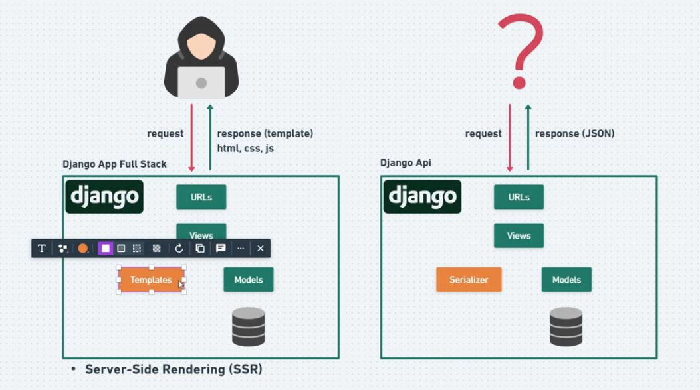
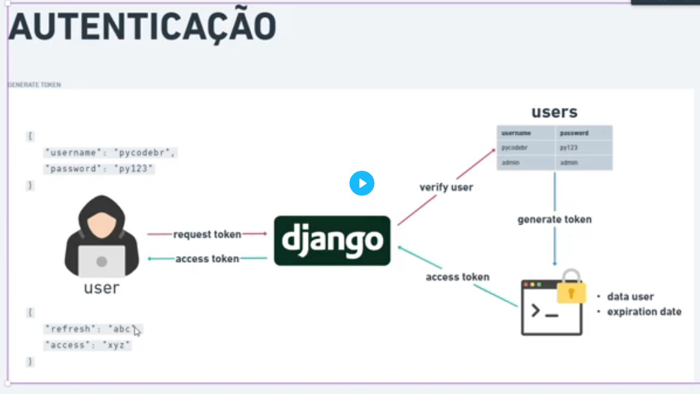
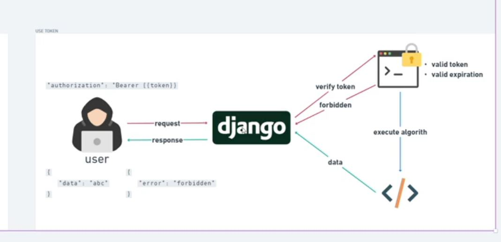
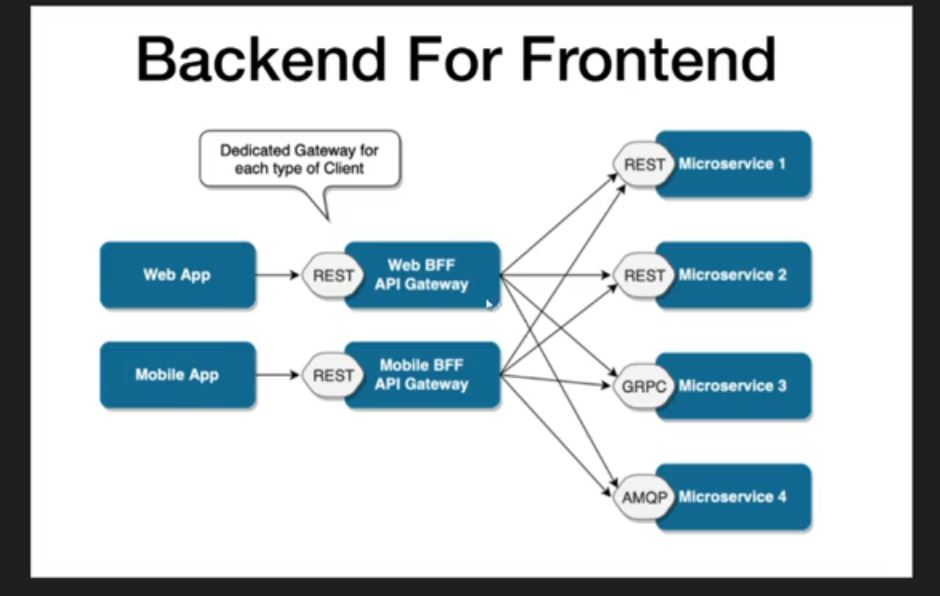

# Django Rest Framework 
- https://www.django-rest-framework.org/
- pip install djangorestframework
- Em settings.py adicionar "rest_framework" no INSTALLED_APPS

- 

  

- utilizar generic views
    from rest_framework import generics
    criar arquivo serializers.py dentro da app

- ativar venv
- python manage.py startapp actors
- Em settings.py adicionar "actors" no INSTALLED_APPS
- criar a model
- python manage.py makemigrations
- python manage.py migrate
- registrar no admin
- criar a class view herdando de generics
- criar arquivo serializers.py
- configurar o urls.py

# Versionamento
- um arquivo urls.py para cada app do projeto
- dominio.com/api/v1/movies/
- exemplo de urls.py na pasta do projeto:
    path('api/v1/', include('genres.urls')),
    path('api/v2/', include('genres.urls_v2')),

# Serializers
- ModelSerializer : herda tudo do model em que está ligado, definição automática campos, regras e validações

# JWT (Access Tokens)

- Documentação: https://django-rest-framework-simplejwt.readthedocs.io/en/latest/getting_started.html
- 

  

- 

  

- pip install djangorestframework-simplejwt
- em settings:
    'rest_framework_simplejwt' em INSTALLED_APPS

- criar app nova 'authentication' e adicionar em INSTALLED_APPS settings.py
- utilizar apenas arquivos apps.py e urls.py dentro desta app, (demais pode deletar)
- criar urls.py dentro da app
- em settings.py
    REST_FRAMEWORK = {
    ...
    'DEFAULT_AUTHENTICATION_CLASSES': (
        ...
        'rest_framework_simplejwt.authentication.JWTAuthentication',
    )
    ...
}
    novo usuario: cinemark djangomaster

- Fechar as urls das views para utilizar apenas com tokens
    Dentro das Views colocar o atributo: permission_classes = (IsAuthenticated,)

- variável do simple JWT dentro de settings.py

    SIMPLE_JWT = {
    "ACCESS_TOKEN_LIFETIME": timedelta(minutes=5),
    "REFRESH_TOKEN_LIFETIME": timedelta(days=1),
    
}
  
# Permissões de Usuário

- Configurar no admin do Django
- criar permissions.py dentro da pasta do projeto Uma classe global para todos os apps
    criar classe de permissao que herda de permissions.BasePermission
    cadastrar a permissão no admin do Django

# PEP 8 (Propostas de aprimoramento Python)

- https://peps.python.org/pep-0008/

    -def minha_funcao()
    -minha_variavel
    -class MinhaClasse
    -MINHA_CONSTANTE = 10

    -duas linhas em branco depois das importações

    linting: Flake8
    pip install flake8
    no terminal: flake8

    arquivo .flake8
        [flake8]
        exclude = venv
        ignore=E501

# Backend For Frontend e Api Gateway
- 

  

- Exemplo de Classe no projeto : MovieListDetailSerializer

# Django Custom Commands

- https://docs.djangoproject.com/pt-br/5.0/howto/custom-management-commands/
- python manage.py <nome_do_comando>
- python manage.py import_actors actors.csv

# Gerar e ler arquivo requirements.txt
- pip freeze > requirements.txt
- pip install -r requirements.txt

# Deploy 

-  no settings.py : STATIC_ROOT = os.path.join(BASE_DIR, 'staticfiles')
-  https://www.pythonanywhere.com/
-  https://help.pythonanywhere.com/pages/DeployExistingDjangoProject/